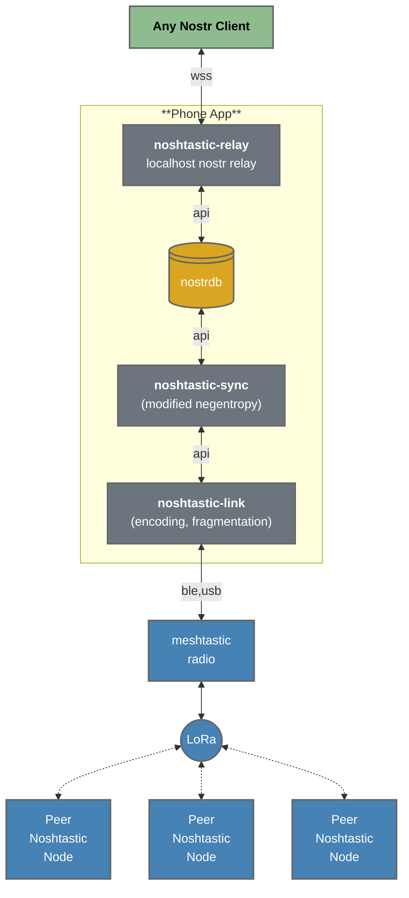
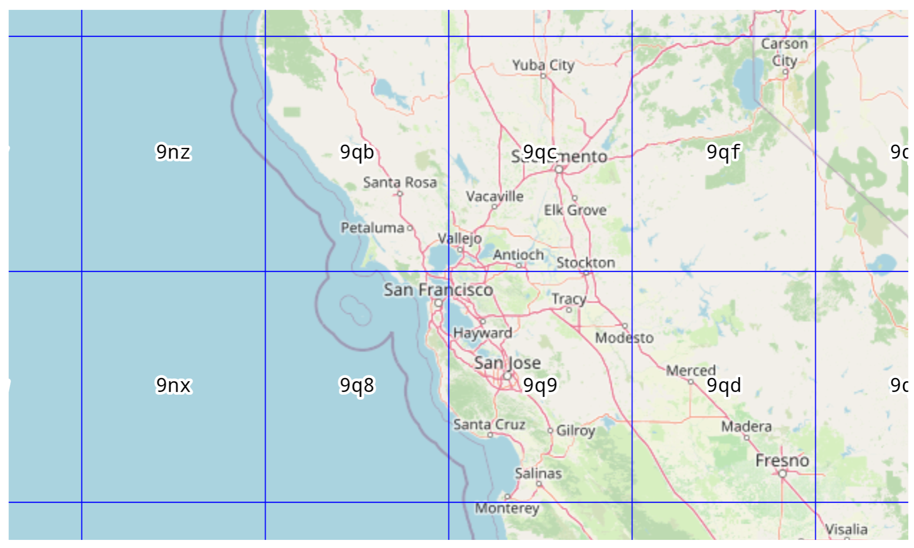

# Noshtastic: A Geo-Specific Virtual Nostr Relay for Meshtastic

**Noshtastic** operates as a **standalone Nostr network**, designed to
function independently of internet-based Nostr relays. Unlike other
setups that rely on gatewaying nostr events to and from
internet-connected relays, Noshtastic focuses on creating a
decentralized and fully self-sufficient communication network using
only Meshtastic devices. This ensures reliable message synchronization
even in environments without internet connectivity.


Noshtastic uses negentropy-based synchronization configured using geohash-specified regions. A geohash location tag is added to events intended for Noshtastic distribution:
```
...
{
  "tags": [
    ...
    ["nosh", "9q9p1dtf1"],
    ...
  ],
}
...
```

Noshtastic relays are configured to synchronize messages for specific
regions.  For example a noshtastic relay might cover **`9q[bc89]`**
(the region including `9qb`, `9qc`, `9q8`, and `9q9`).



*Image source: [Geohash Explorer by Chris Hewett](https://chrishewett.com/blog/geohash-explorer/)*
