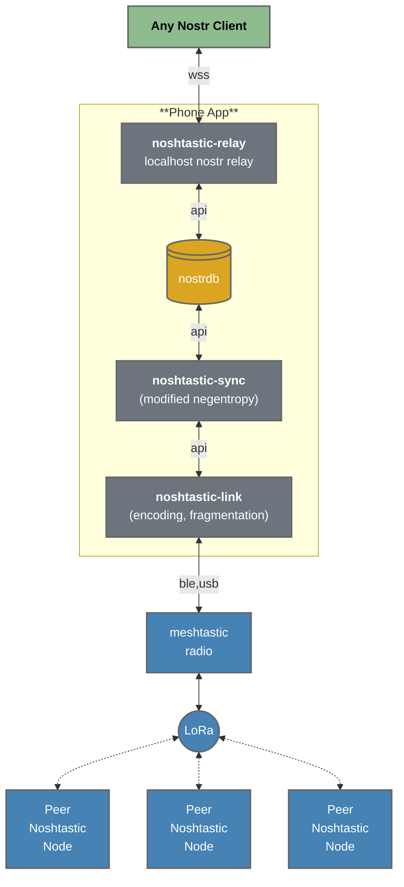
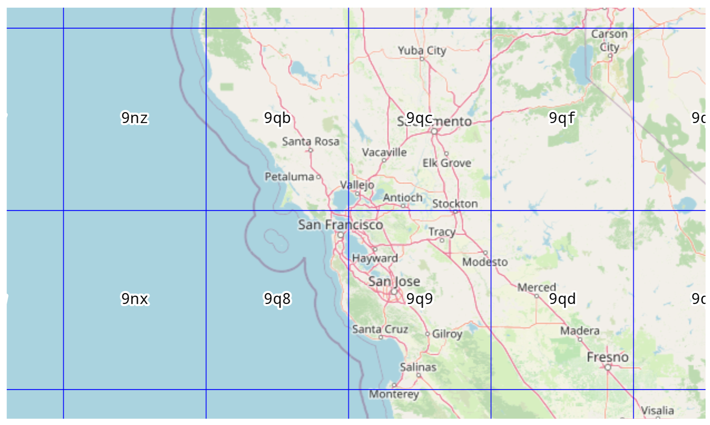

# Noshtastic: A Geo-Specific Virtual Nostr Relay for Meshtastic

**Noshtastic** operates as a **standalone Nostr network**, designed to
function independently of internet-based Nostr relays. Unlike other
setups that rely on gatewaying nostr events to and from
internet-connected relays, Noshtastic focuses on creating a
decentralized and fully self-sufficient communication network using
only Meshtastic devices. This ensures reliable message synchronization
even in environments without internet connectivity.


Noshtastic uses negentropy-based synchronization configured using geohash-specified regions. A geohash location tag is added to events intended for Noshtastic distribution:
```
...
{
  "tags": [
    ...
    ["nosh", "9q9p1dtf1"],
    ...
  ],
}
...
```

Noshtastic relays are configured to synchronize messages for specific
regions.  For example a noshtastic relay might cover **`9q[bc89]`**
(the region including `9qb`, `9qc`, `9q8`, and `9q9`).



*Image source: [Geohash Explorer by Chris Hewett](https://chrishewett.com/blog/geohash-explorer/)*

## Check out the [Noshtastic Blog](https://ksedgwic.github.io/noshtastic/)

## Building

### Setup Prerequisites

On Debian (and Ubuntu):
```
sudo apt update
sudo apt install -y build-essential clang curl git make
sudo apt install -y pkg-config libssl-dev libudev-dev libdbus-1-dev
sudo apt install -y protobuf-compiler libprotobuf-dev libprotobuf-c-dev protobuf-c-compiler
sudo apt install -y openjdk-17-jdk unzip wget sdkmanager
```

On Fedora:
```
sudo dnf update
sudo dnf groupinstall -y "C Development Tools and Libraries" "Development Tools"
sudo dnf install -y clang curl git pkg-config openssl-devel systemd-devel
sudo dnf install -y protobuf protobuf-c protobuf-compiler protobuf-devel
sudo dnf install -y java-17-openjdk-devel
```

If you don't have rust installed:
```
curl --proto '=https' --tlsv1.3 https://sh.rustup.rs -sSf | sh
source $HOME/.cargo/env
rustup update
rustup component add clippy rustfmt
rustup target install aarch64-linux-android
cargo install cargo-ndk
```

If you don't have Android Studio and Android NDK installed:
```
sudo snap install android-studio --classic
export ANDROID_HOME=$HOME/Android/Sdk
export ANDROID_SDK_ROOT=$ANDROID_HOME
export ANDROID_NDK_HOME=$ANDROID_HOME/ndk/25.2.9519653
export PATH=$PATH:$ANDROID_HOME/tools/bin
mkdir -p $ANDROID_HOME
yes | sdkmanager --licenses
sdkmanager "platform-tools" "platforms;android-33" "ndk;25.2.9519653"
```

Setup env variables in your startup script ...
```
cat << 'EOF' >> ~/.bashrc

# Android SDK/NDK setup
export ANDROID_SDK_ROOT="$HOME/Android/Sdk"
export ANDROID_HOME="$ANDROID_SDK_ROOT"
export ANDROID_NDK_HOME="$ANDROID_SDK_ROOT/ndk/25.2.9519653"
export PATH="$PATH:$ANDROID_SDK_ROOT/tools/bin:$ANDROID_SDK_ROOT/platform-tools:$ANDROID_NDK_HOME:$ANDROID_HOME/cmdline-tools/latest/bin:$ANDROID_HOME/build-tools/selected"
EOF
```
... then `source ~/.bashrc`

Verify:
```
adb --version
ndk-build --version
echo $ANDROID_HOME $ANDROID_NDK_HOME
```

### Build Unix CLI

```
make cli
```

### Build Android App

Connect an android phone via USB to the build computer and:

```
git submodule update --init
make android
```
