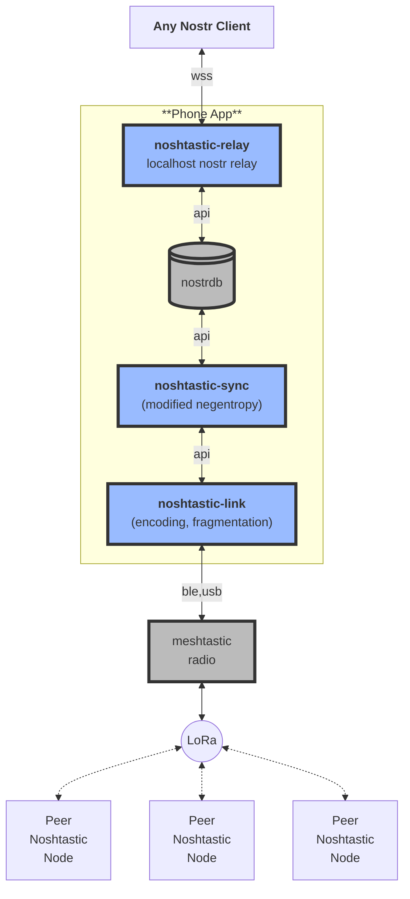

# Noshtastic

A broadcast negentropy meshtastic nostr relay

```mermaid
flowchart TD
   CLIENT["`**Any Nostr Client**`"]
   style MESH fill:#bbb,stroke:#333,stroke-width:4px

   RELAY["`**noshtastic-relay**
   localhost nostr relay`"]
   style RELAY fill:#9bf,stroke:#333,stroke-width:4px

   NOSTRDB@{ shape: lin-cyl, label: "nostrdb" }
   style NOSTRDB fill:#bbb,stroke:#333,stroke-width:4px

   SYNC["`**noshtastic-sync**
   (modified negentropy)`"]
   style SYNC fill:#9bf,stroke:#333,stroke-width:4px

   LINK["`**noshtastic-link**
   (encoding, fragmentation)`"]
   style LINK fill:#9bf,stroke:#333,stroke-width:4px

   MESH["`meshtastic
   radio`"]
   style MESH fill:#bbb,stroke:#333,stroke-width:4px

   LORA(("`LoRa`"))

   PEER0["`Peer
   Noshtastic
   Node`"]

   PEER1["`Peer
   Noshtastic
   Node`"]

   PEER2["`Peer
   Noshtastic
   Node`"]

   CLIENT<-->|wss|RELAY

   subgraph **Phone App**
   RELAY<-->|api|NOSTRDB
   NOSTRDB<-->|api|SYNC
   SYNC<-->|api|LINK
   end

   LINK<-->|ble,usb|MESH
   MESH<-->LORA
   LORA<-.->PEER0
   LORA<-.->PEER1
   LORA<-.->PEER2
```
