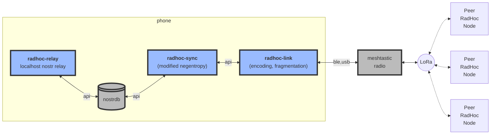

# RadHoc

```mermaid
flowchart LR
   RELAY["`**radhoc-relay**
   localhost nostr relay`"]
   style RELAY fill:#9bf,stroke:#333,stroke-width:4px

   GHOST1[ ]
   style GHOST1 fill:none,stroke:none

   GHOST2[ ]
   style GHOST2 fill:none,stroke:none

   NOSTRDB@{ shape: lin-cyl, label: "nostrdb" }
   style NOSTRDB fill:#bbb,stroke:#333,stroke-width:4px

   SYNC["`**radhoc-sync**
   (modified negentropy)`"]
   style SYNC fill:#9bf,stroke:#333,stroke-width:4px

   LINK["`**radhoc-link**
   (encoding, fragmentation)`"]
   style LINK fill:#9bf,stroke:#333,stroke-width:4px

   MESH["`meshtastic
   radio`"]
   style MESH fill:#bbb,stroke:#333,stroke-width:4px

   LORA(("`LoRa`"))

   PEER0["`Peer
   RadHoc
   Node`"]

   PEER1["`Peer
   RadHoc
   Node`"]

   PEER2["`Peer
   RadHoc
   Node`"]

   subgraph phone
   RELAY ~~~ GHOST1
   RELAY ~~~ GHOST2
   RELAY<-->|api|NOSTRDB
   GHOST1 ~~~ SYNC
   GHOST2 ~~~ SYNC
   NOSTRDB<-->|api|SYNC
   SYNC<-->|api|LINK
   end

   LINK<-->|ble,usb|MESH
   MESH<-->LORA
   LORA<-.->PEER0
   LORA<-.->PEER1
   LORA<-.->PEER2
```
